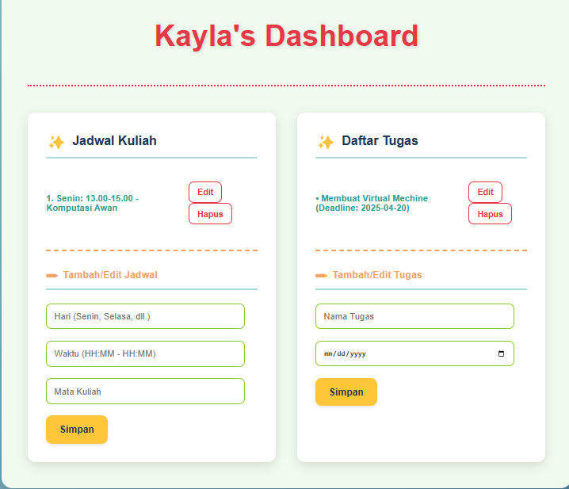

# Personal Dashboard
Aplikasi web ini dirancang untuk membantu dalam mengatur jadwal kuliah dan daftar tugas dalam satu tempat yang mudah diakses sehingga kita dapat mengetahui jadwal kuliah serta tugas apa yang diberikan dan deadline yang diberikan.

## Fitur Utama

* **Manajemen Jadwal Kuliah:**
    * Menampilkan daftar jadwal kuliah berdasarkan hari dan waktu.
    * Fitur untuk menambah, mengedit, dan menghapus jadwal kuliah.
* **Manajemen Daftar Tugas:**
    * Menampilkan daftar tugas beserta deadline.
    * Fitur untuk menambah, mengedit, dan menghapus tugas.
    
## Screenshot Aplikasi

## Fitur ES6+ yang Diimplementasikan

* **Deklarasi Variabel dengan `let` dan `const`:** Digunakan secara tepat untuk mengelola scope variabel dan nilai yang tidak dapat diubah.
* **Arrow Functions:** Minimal tiga arrow functions diimplementasikan untuk sintaks yang lebih ringkas dan pengelolaan konteks `this` yang lebih baik (contoh: `getData`, `saveData`, `toggleSelesaiTugas`).
* **Template Literals:** Digunakan untuk membuat string HTML secara dinamis dalam fungsi rendering (`renderJadwal`, `renderTugas`)
* **Fungsi Asinkron (`async/await` dengan Promises):** Fungsi `loadData` menggunakan `async/await` untuk menangani operasi asinkron, memungkinkan penulisan kode asinkron yang lebih mudah dibaca.
* **Implementasi Classes:** Struktur aplikasi menggunakan class `Dashboard`, memfasilitasi enkapsulasi data dan metode.

## Cara Penggunaan

1.  Buka file `index.html` di browser web.
2.  Dapat menambahkan, mengedit, dan menghapus jadwal kuliah dan tugas.

